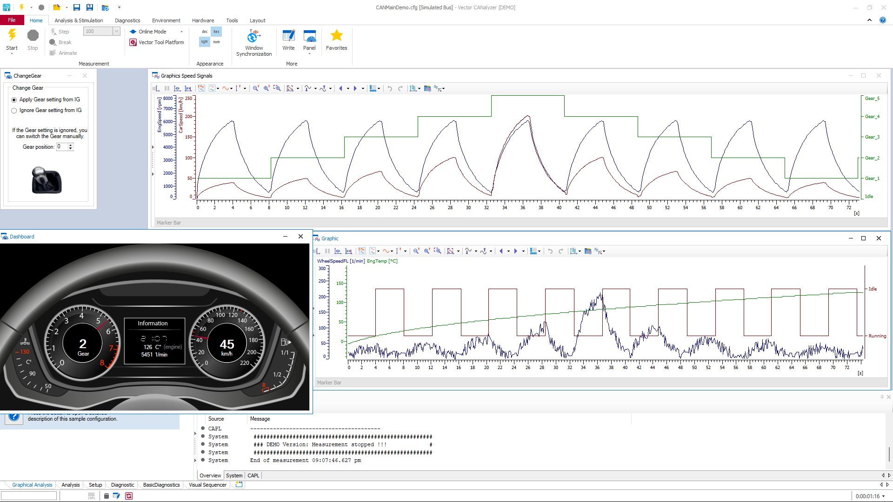

# CANoe Signal Mapping

This repository contains a conceptual walkthrough and demo implementation of a CANoe signal mapping workflow. It is intended as a **learning project** to brush up on signal flow, diagnostics, and simulation concepts in CANoe.

> ⚠️ **Note:** This is a **demo version** and not a fully integrated simulation. Some parts, like UDS diagnostics or interactive simulations, are structured based on theoretical understanding due to demo limitations.

---

## Objective

To simulate a basic CAN signal mapping and control flow using CANoe, covering:

- **Diagnostic simulation (UDS)**
- **Panel control with buttons**
- **Node behavior and mapping logic**
- **DTC handling and request-response flow**

---

## What I Learned

- Refreshed key **CANoe concepts** including environment setup, panel design, and CAPL coding.
- Understood how **UDS diagnostics** (like 0x22, 0x2E, 0x19) are structured.
- Practiced **panel integration** with button events and signal triggers.
- Learned how to **simulate multiple ECUs** and route signals logically.
- Gained insight into **DTC status byte manipulation** and simulation.

---

## Project Structure

- `CANoe_Config/` – Main configuration files for CANoe.
- `Panel/` – Custom HMI panel with control buttons.
- `Images/` – Screenshots including system dashboard.

---

## System Dashboard

Here’s a snapshot of the system dashboard used for this tutorial:

---

## CAPL Highlights

- **Input Node:** Handles panel button presses and broadcasts signals.
- **Mapping Node:** Translates or filters signals, simulates DTC status logic.
- **Control Node:** Acts on diagnostic requests and sends appropriate responses.

---

## Diagnostic Flow (UDS)

1. **0x22 - Read Data By Identifier:** Used to fetch status bytes.
2. **0x2E - Write Data By Identifier:** Used to inject test DTCs or manipulate signal behavior.
3. **0x19 - Read DTC Info:** Demonstrates DTC reporting.

---

## Limitations

- Some UDS responses are mocked due to lack of real backend interaction.
- No live simulation of signal routing via CAN channels.
- File/database integration is not implemented (used hardcoded values).

---

## References

- Vector CANoe Documentation
- ISO 14229 (UDS protocol)
- CAPL Help and Examples

---

## Conclusion

Though simplified, this project served as a **great refresher** and helped solidify my understanding of signal behavior in a CAN-based environment. It paved the way for more advanced simulations with actual ECU models or integration with OEM-supplied DBCs and databases.

---

