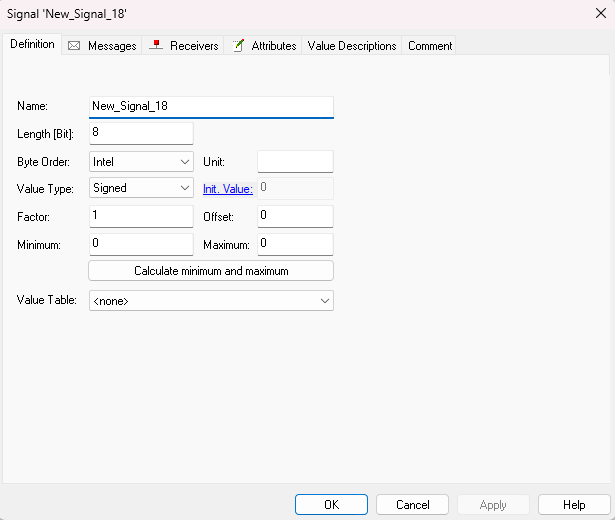
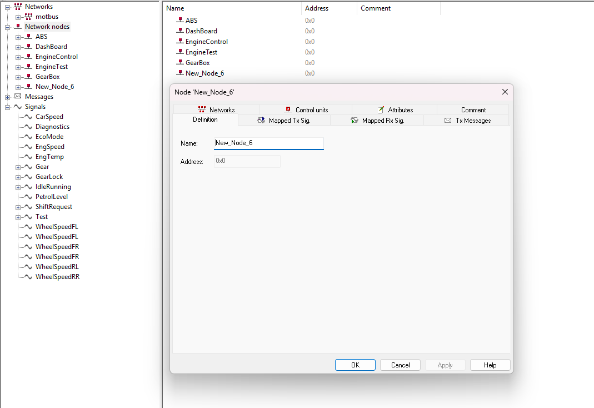
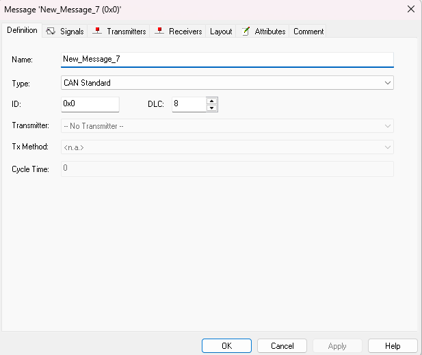
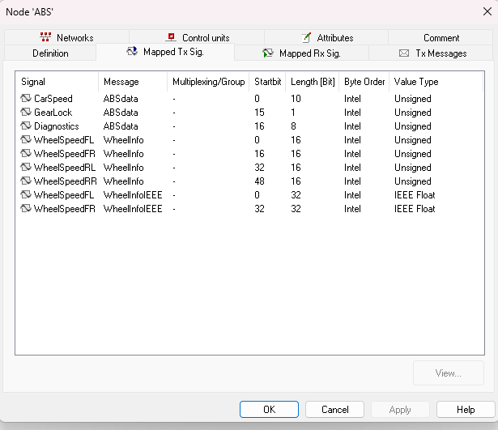
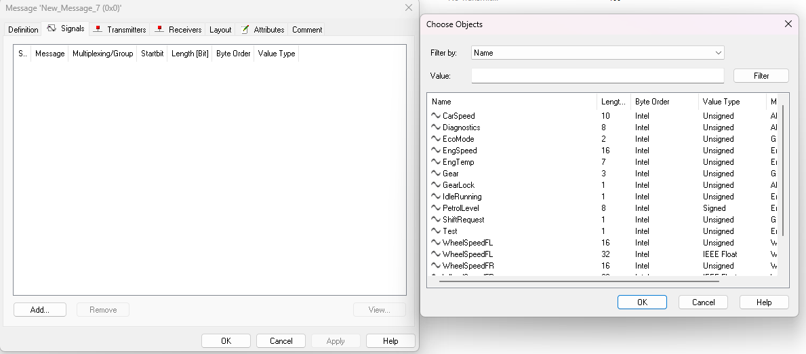
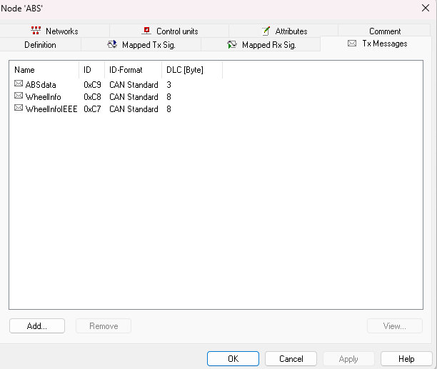

# Vector CANoe Signal Mapping Tutorial
## Overview

This repository serves as a **self-learning documentation** and step-by-step tutorial for working with **Vector CANoe** — specifically focused on **creating new nodes, messages, and integrating signals**.

The tutorial was constructed using a practical, hands-on approach. All screenshots were captured during actual implementation, and the structure aims to be beginner-friendly for automotive communication development.

---

## Tutorial Steps

### 1. Creating a New Signal

- 
- **Description**:  
  This is the first step where we define a new signal using Vector's database editor.
  - Right-click inside the signal list → Select `New Signal`
  - Name your signal appropriately (e.g., `Vehicle_Speed`, `Brake_Status`)
  - Configure properties like bit length, byte order, value range, etc.

---

### 2. Creating a New Node
- 
- **Description**:  
  A node represents an ECU in the network. We create one to simulate the behavior.
  - Go to the CANdb++ editor.
  - Add a new node (e.g., `Test_Node`)
  - Assign a TX message to it for simulation purposes.

---

###3. Creating a New Message
- 
- **Description**:  
  Messages are containers for signals. In this step:
  - Define a message name (e.g., `Status_Message`)
  - Assign message ID and cycle time
  - Map it under the node you created earlier

---

### 4. Mapping Signals to Message
- 
- **Description**:  
  Now we assign the signals to the created message.
  - Open the message properties
  - Add signals to be transmitted by this message
  - Set start bit and length appropriately

---

### 5. Integrating Signals
- 
- **Description**:  
  Final step in integrating signals into CANoe simulation:
  - Use the Simulation Setup view to drag/drop your configured message
  - Bind the TX/RX ports
  - Add environment variables or loggers as needed

---

### 🧭 6. Mapping Message Across Network
- 
- **Description**:  
  This stage helps with defining **message routing**.
  - Define message gateways (if needed)
  - Configure multiplexed messages if present
  - Check consistency across bus systems

---

## Purpose

> *“I created this tutorial as a personal learning basis while exploring CANoe for automotive diagnostics and network communication. Each step is captured with relevant images and simplified explanations.”*

---

## Files

| File Name               | Description                      |
|------------------------|----------------------------------|
| `NEW_SIGNAL.png`       | Create a new signal              |
| `NEWNODE.png`          | Create a new node (ECU)          |
| `CREATE_MESSAGE.png`   | Define a new CAN message         |
| `MAPPING_RX_SIGNALS.png` | Map signals to the message     |
| `INTEGRATING_SIGNALS.png` | Signal integration setup      |
| `MAPPING_MESSAGE.png`  | Message routing/mapping overview |

---

## Tools Used

- **Vector CANoe**
- **Vector CANdb++**
- ECU System Simulation

---

## Next Steps

- Add CAPL scripts for simulating signal changes
- Enable logging and diagnostics for each message
- Setup test cases for signal range validation

---
