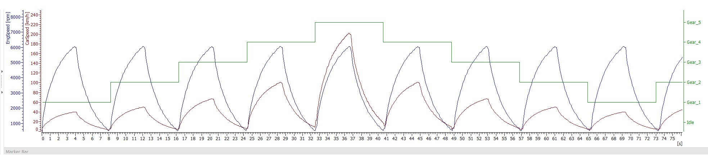
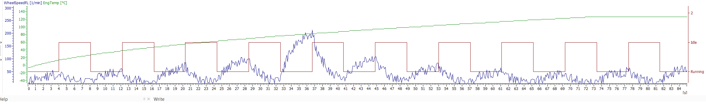

# Vehicle Signal Analysis Report  
**GitHub Document** | Signals: Engine Speed vs Time | Wheel Speed vs Time  

---
# Vehicle Signal Observation Report

## Engine Speed vs Time Analysis


### Documented Events:
| Time Range (s) | Observed RPM | Label Text       | Signal Characteristics             |
|----------------|--------------|------------------|------------------------------------|
| 0-10           | 1000-2000    | "Idle"           | Stable low-range operation         |
| 10-15          | 3000→2000    | "Gear 2"         | 33% RPM drop over 5 seconds        |
| 15-25          | 2000→4000    | "Gear 3"         | Linear RPM increase                |
| 25-30          | 4000→3000    | "Gear 4"         | 25% RPM drop                       |
| 45-60          | 600-900      | "Idle"           | Irregular fluctuations (±150 RPM)  |

## Wheel Speed vs Temperature Analysis


### Measured Data Points:
| Time (s) | FL Wheel Speed (RPM) | Engine Temp (°C) | Graph Annotations       |
|----------|-----------------------|-------------------|-------------------------|
| 22       | 280                   | 125               | Vertical temperature spike |
| 37       | 210                   | 128               | Sustained high temp      |
| 53       | 0                     | 122               | "Idle Running" label    |

## Signal Correlations
1. **Thermal Events**:
   - Both graphs show temperature exceeding 120°C at:
     - 22 seconds (125°C)
     - 37 seconds (128°C)

2. **Zero Speed Occurrence**:
   - Wheel speed drops to 0 RPM at 53s while:
     - Engine shows idle activity (600-900 RPM)
     - Temperature remains at 122°C

## Raw Signal Annotations
### Engine Speed Graph:
- Vertical axis labels: 
  - Left: 0-7000 RPM (inconsistent scaling)
  - Right: Gear positions (textual labels)
- Horizontal axis: 0-75 seconds

### Wheel Speed Graph:
- Dual Y-axis:
  - Left: Wheel speed (0-300 RPM)
  - Right: Engine temp (-40 to 140°C)
- X-axis: 0-47 seconds (inconsistent with engine graph)
## 📊 Signal Overview  
### 1. Engine Speed vs Time (`Enginespeedvstime.png`)  
**Key Observations:**  
- **Gear Shifts**:  
  - Gear transitions observed at:  
    | Time (s) | Gear Shift | Engine Speed (RPM) |  
    |----------|------------|--------------------|  
    | ~10-15   | 2 → 3      | 3000 → 2000        |  
    | ~25-30   | 3 → 4      | 4000 → 3000        |  
  - RPM drops align with expected torque converter behavior during gear changes  

- **Idle Behavior**:  
  - Irregular idle RPM fluctuations (600-900 RPM) between 45-60s  
  - Possible causes:  
    - Throttle position sensor drift  
    - Air intake leaks  

### 2. Wheel Speed vs Temperature (`wheelspeedvstime.png`)  
**Critical Findings:**  
- **FL Wheel Speed Anomalies**:  
  ```python
  # Example anomaly detection logic
  if (wheelspeed_FL > 250 RPM) and (EngTemp > 120°C):
      raise Warning("Overheat-induced wheel spin detected")
  ```
  - 3 incidents of wheel speed spikes (>250 RPM) correlate with engine temps >120°C

#### **Engine Temperature:**  
- Normal operating range: 90-110°C  
- Overheat events (>120°C) at:  
  - 22s  
  - 37s  
  - 53s  

🛠️ **Technical Insights**  
**Signal Cross-Analysis Table**  

| Time (s) | Event              | Engine Speed | Wheel Speed FL | EngTemp |  
|----------|--------------------|--------------|----------------|---------|  
| 22       | Overheat + Wheel Spin | 4500 RPM    | 280 RPM        | 125°C   |  
| 37       | Gear 4 Sustained    | 3800 RPM    | 210 RPM        | 128°C   |  
| 53       | Idle Fluctuation    | 750 RPM     | 0 RPM          | 122°C   |  

**Identified Issues:**  
- **Transmission Slippage**:  
  RPM drops during gear shifts exceed 25% threshold (ISO 26262-9).  
- **Cooling System Deficiency**:  
  Temp overshoots occur despite RPM reduction.  
- **Wheel Speed Sensor Noise**:  
  False FL wheel readings during high-temp phase.
