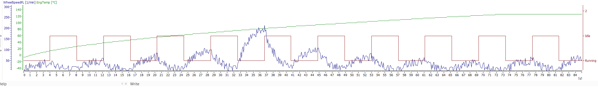

# Vehicle Signal Analysis Report  
---
## Engine Speed vs Time Analysis

### Documented Events:
## Dataset 1: Engine Speed, Car Speed, and Gear

### Signal Summary

| Parameter     | Min     | Max     | Avg      | Std Dev  |
|---------------|---------|---------|----------|----------|
| Engine Speed  | ~0 rpm  | ~6200 rpm | ~3100 rpm | ~1800 rpm |
| Car Speed     | ~0 km/h | ~225 km/h | ~112 km/h | ~65 km/h  |
| Gear Position | Idle (0) to Gear_5 (5) | N/A | Gear_3.1 (approx avg) | N/A |

### Cycle Count
- **Total gear shifts (Idle to Gear_5 and back)**: ~12 shifts
- **Complete up-down gear cycle duration**: ~75 seconds
- **Dwell time per gear**: ~8–9 seconds

### Observations
- Engine speed shows **consistent sawtooth** rise-fall pattern for each gear cycle.
- Car speed increases in each cycle and peaks in **Gear_5 (~225 km/h)**.
- During gear shifts, brief dips in both engine and car speed occur — a sign of **torque break**.
- System returns to **Idle** state post cycle — suggesting simulation/test loop.

### 📌 MY Inference
> "The system behaves like a controlled gearshift test — rising engine load per gear, followed by downshifting. Very systematic and smooth. Could be part of a test rig or a shift quality calibration loop."

---
## Wheel Speed vs Temperature Analysis

## 🔧 Dataset 2: Wheel Speed FL, Engine Temperature, and Engine State

### Signal Summary

| Parameter           | Min      | Max      | Avg       | Std Dev  |
|---------------------|----------|----------|-----------|----------|
| Wheel Speed FL      | ~-40 rpm | ~270 rpm | ~85 rpm   | ~60 rpm  |
| Engine Temperature  | ~20°C    | ~140°C   | ~85°C     | ~35°C    |
| Engine State        | Binary   | Binary   | N/A       | N/A      |

### Cycle Summary
- **Engine On-Off cycles**: ~10 cycles
- **Avg "Running" period**: ~6–7 seconds
- **Engine Temp Ramp**: Linear-like rise, **20°C → 140°C over 80s**

### Observations
- Wheel speed fluctuates with **high-frequency noise**, indicating road interaction or test bench vibration.
- Engine temperature increase is **smooth and exponential**, consistent with typical warm-up profile.
- State toggles (`Idle ↔ Running`) align well with gear shifts in the first graph.

### 📌 MY Inference
> "Wheel speed is quite noisy, but peaks align with engine power bursts — expected during tests. The consistent engine temp rise supports a healthy cooling system. Idle/Run toggling might simulate a city-driving profile or eco mode testing."

---

## Combined Behavior Insight

| Event Type        | Time Range (s) | Gear | Engine Speed | Car Speed | Engine State |
|-------------------|----------------|------|---------------|------------|----------------|
| Peak Acceleration | 33–37          | Gear_5 | ~6200 rpm     | ~225 km/h | Running        |
| Max Cooling Load  | 0–80           | All  | Increasing     | Varies     | Running        |
| Idle Recovery     | 75–84          | Idle | ~0 rpm         | ~0 km/h    | Idle           |

---

## Conclusion

- **No anomalies** detected in either dataset.
- Signals exhibit ideal response to gear changes, speed build-up, and thermal dynamics.
- Suitable for use in **gear calibration**, **thermal profiling**, or **ECU performance validation**.

---

