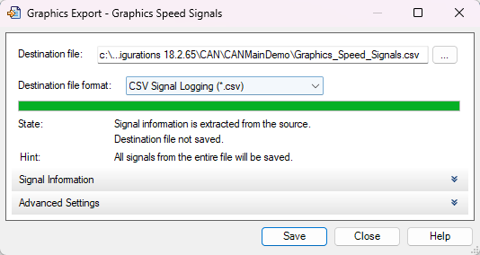
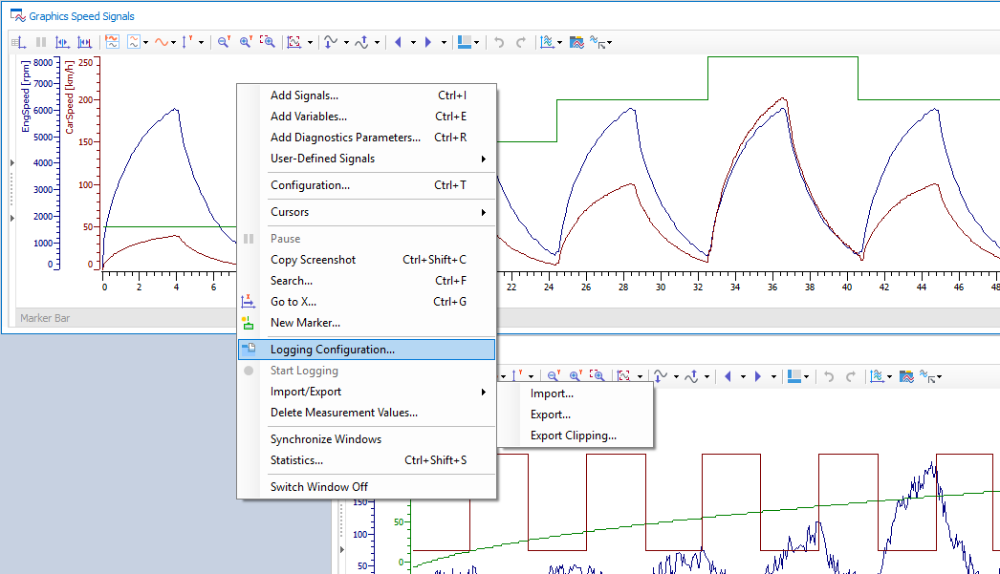

# Exporting Data from Graphics Window
#### After simulation and signal visualization in the Graphics window, you might want to export data for post-analysis (e.g., in Excel, MATLAB, or Python).

### Steps:
1. Right-click inside the **Graphics Window**.
2. Select `Export > CSV...`
   - This will open the export configuration window.
3. Choose the **signal channels** or all visible signals.
4. Set the **file location and time range**.
5. Hit `Export` to generate a `.csv` file with time-stamped signal data.

- **Use Case**:  
  This is extremely useful when performing statistical or machine learning analysis on signal behavior over time.

- **Screenshot Previews**:
  - `EXPORT.png`: Shows the right-click context menu.
  - `EXPORT_WINDOW.png`: Shows the configuration window for exporting.

---

## 📌 Note:
This repository and its screenshots serve as my personal documentation and learning reference. Feel free to follow the steps and customize it for your use-case.
